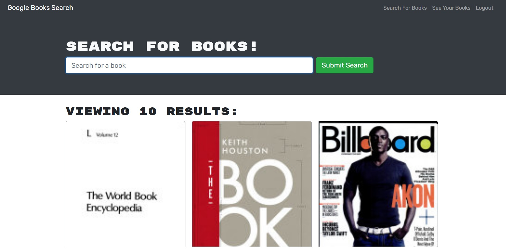

# Book-search-engine

## Description

A functioning Google Books API search engine through a GraphQL API
built with Apollo server. The app is built using the MERN stack, with a React front end, MongoDB database, and Node.js/Express.js server and API.

## Built with

- JavaScript
- MongoDB database
- mongoose
- Node.js
- React
- Express.js
- GraphQL with Apollo server
- Jsonwebtoken
- bcrypt

## Deployed application

https://book-serach-engine-api.onrender.com

## Installation

`npm init`

`npx create-react-app`

`npm install apollo-server-express graphql`

## Usage

`npm run develop`

## Screenshot

## Author

Jin Lee. Please visit, https://infinissible.github.io/Jinovation-react-portfolio/
